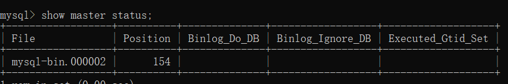
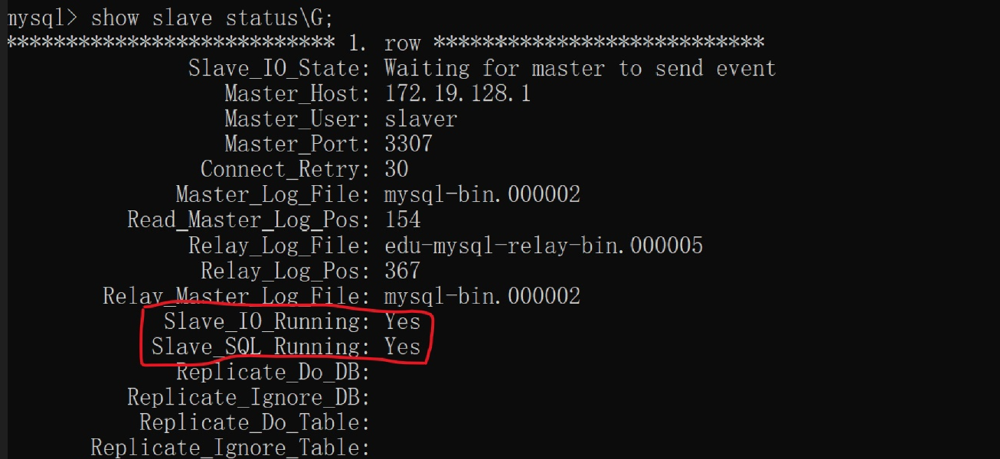

#### Docker 安装软件步骤

搜索镜像，拉取镜像，查看镜像，启动镜像，停止容器，移除容器 

安装MySQL镜像时注意编码问题，show variables like 'character%'(查看编码方式)，数据备份（容器数据卷）

解决编码格式新建my.cnf文件，配置编码格式（vim /docker/mysql/conf/my.cnf）

````my.cnf
[client] 
default_character_set=utf8
[mysqld]
collation_server = utf8_general_ci
character_set_server = utf8）
````

```console
docker run --name some-mysql -p 3306:3306 -e MYSQL_ROOT_PASSWORD=my-secret-pw -d mysql:tag（基础版mysql）
docker run --name some-mysql -p 3306:3306 -e --privileged=true
-v /docker/mysql/log:/var/log/mysql
-v -v /docker/mysql/data:/var/lib/mysql
-v /docker/mysql/conf:/etc/mysql/conf.d
MYSQL_ROOT_PASSWORD=my-secret-pw -d mysql:tag
```

安装redis镜像时需要注意的问题：容器卷，指定redis配置文件，copy 文件redis.conf 到本机目录文件夹下

````
docker run -p 6379:6379 --name myredis 
-v /usr/local/docker/redis/redis.conf:/etc/redis/redis.conf 
-v /usr/local/docker/redis/data:/data 
-d redis redis-server /etc/redis/redis.conf //后台启动，读取指定的配置文件（/etc/redis/redis.conf）
--appendonly yes
````


#### Dockers容器卷

数据持久化。映射，容器内的数据备份+持久化到本地主机目录；共享；实时生效；本地主机和容器内相互的，两者保持一致。

docker run -it --privileged=true  -v /宿主机绝对路劲目录：/容器内目录:ro 镜像名 ro（read  onl y)是设置容器的读写权限

查看数据卷是否成功 docker inspect 容器ID ，查看mounts挂在情况

容器继承容器docker run -it --privileged=true  --volumes-from u

#### Docker 容器卷和绑定挂载的区别

```
绑定挂载从Docker最早的时候就可以用于数据持久化。绑定挂载将把一个文件或目录从主机上挂载到你的容器上，然后你可以通过其绝对路径来引用。
docker run -d -v /hostdata:/app/data myapp
宿主机上的/hostdata目录与容器的/app/data目录关联起来，容器可以在此目录中读取和写入宿主机上的文件。
```

```
卷是在Docker容器中添加数据保存层的一个很好的机制，特别是在你需要在关闭容器后保存数据的情况下。

Docker卷完全由Docker本身处理，因此与你的目录结构和主机的操作系统无关。当你使用卷时，在主机上的Docker存储目录中会创建一个新的目录，而Docker会管理该目录的内容。

docker volume create myvolume
docker run -d -v myvolume:/app/data myapp
数据卷myvolume与容器的/app/data目录关联起来，容器可以在此目录中读取和写入数据。
```

#### Docker Mysql 主从复制搭建

```
docker run -p 3307:3306 --name mysql-master
-v /mydata/mysql-master/log:/var/log/mysql
-v /mydata/mysql-master/data:/var/lib/mysql
-v /mydata/mysql-master/conf:/etc/mysql
-e MYSQL_ROOT_PASSWORD = root
-d mysql:5.7//版本
配置conf文件，在/mydata/mysql-master/conf新建my.conf文件，并配置，重启容器
进入mysql-master容器，master容器实例内创建数据同步用户

创建从mysql服务器
docker run -p 3308:3306 --name mysql-slave
-v /mydata/mysql-master/log:/var/log/mysql
-v /mydata/mysql-master/data:/var/lib/mysql
-v /mydata/mysql-master/conf:/etc/mysql
-e MYSQL_ROOT_PASSWORD = root
-d mysql:5.7//版本
配置conf文件，在/mydata/mysql-master/conf新建my.conf文件，并配置，重启容器

回到主服务器查看主从同步状态show master status;
从数据库中配置主从配置
在从服务器中查看主从同步状态 
在从数据库中开启主从同步
```

```
Windows自己配置MySQL主从复制
先在本地创建my.cnf配置文件，目录如挂载的绝对路径；分别创建主从数据库的配置文件，master和slave;
创建主MySQL数据库
docker run -itd --name=master -p 3307:3306 //itd 后台运行
-e MYSQL_ROOT_PASSWORD=root
-v /d/demo/mysql/master/conf/my.cnf:/etc/mysql/my.cnf //直挂载了配置文件的目录
-d mysql:5.7
创建从Mysql数据库
docker run -itd --name=slave -p 3308:3306 //itd 后台运行
-e MYSQL_ROOT_PASSWORD=root
-v /d/demo/mysql/slave/conf/my.cnf:/etc/mysql/my.cnf //直挂载了配置文件的目录
-d mysql:5.7
进入主Mysql容器内部，创建从数据库的权限
CREATE USER 'slave'@'%' IDENTIFIED WITH 'mysql_native_password' BY '123456';
GRANT REPLICATION SLAVE, REPLICATION CLIENT ON *.* TO 'slave'@'%';
FLUSH PRIVILEGES; 
然后查看master状态
show master status;
进入从Mysql容器内部，配置从数据库
change master to master_host='172.19.128.1',master_user='slave',master_password='123456',
master_log_file='mysql-bin.000007',master_log_pos=1564,
master_port=3307, master_connect_retry=30;

master_host :主数据库IP地址，master_port:主数据库运行端口，master_user：在主数据库创建的用于同步数据的账号；
master_password：在主数据库创建的用于同步数据的密码；master_connect_retry：连接失败重连时间间隔，时间为秒；
master_log_file：指定从数据库要复制的数据的日志文件，通过查看主数据库的状态，获取到的File参数
master_log_pos：指定从数据库要复制的数据的日志文件，通过查看主数据库的状态，获取到的Position参数
开启复制
start slave;
查看状态
show slave status\G;如下图红线为Yes为开启了；


在实现主从复制时若出现[Warning] World-writable config file ‘/etc/mysql/conf.d/my.cnf‘ is ignored.
需要设置my.cnf 文件的权限，使用命令chmod 644 my.cnf更改权限，重启容器即可。
```





#### Docker 安装redis集群（3主3从redis集群）

```
方法：哈希取余分区（算法），一致性哈希算法分区，哈希槽分区（一个集群有16384个槽）
启动6台redis容器
1:
docker run -d --name redis-node-1 --net host --privileged=true
-v /data/redis/share/redis-node-1:/data redis:6.0.8
--cluster-enabled yes --appendonly yes --port 6381
2:
docker run -d --name redis-node-2 --net host --privileged=true
-v /data/redis/share/redis-node-2:/data redis:6.0.8
--cluster-enabled yes --appendonly yes --port 6382
3:
docker run -d --name redis-node-3 --net host --privileged=true
-v /data/redis/share/redis-node-3:/data redis:6.0.8
--cluster-enabled yes --appendonly yes --port 6383
4:
docker run -d --name redis-node-4 --net host --privileged=true
-v /data/redis/share/redis-node-4:/data redis:6.0.8
--cluster-enabled yes --appendonly yes --port 6384
5:
docker run -d --name redis-node-5 --net host --privileged=true
-v /data/redis/share/redis-node-5:/data redis:6.0.8
--cluster-enabled yes --appendonly yes --port 6385
6:
docker run -d --name redis-node-6 --net host --privileged=true
-v /data/redis/share/redis-node-6:/data redis:6.0.8
--cluster-enabled yes --appendonly yes --port 6386
进入容器1，执行命令构建主从关系
redis-cli --cluster create 192.168.2.252:6381 192.168.2.252:6382 192.168.2.252:6383 192.168.2.252:6384 192.168.2.252:6385 192.168.2.252:6386 --cluster-replicas 1
查看集群状态
redis-cli -p 6381
cluster info
集群检查
redis-cli --cluster check 192.168.2.252:6381
```

```
Redis集群扩容
新建6387和6388两个容器，并启动
进入6387容器内部，将新增的6387作为master节点加入集群
redis-cli --cluster add-node 192.168.2.252:6387 192.168.2.252:6381
检查集群情况（是否能查到6387）
redis-cli --cluster check 192.168.2.252:6381
重新分配槽号(由前几个容器匀出来给到新的容器)
redis-cli --cluster reshard 192.168.2.252:6381
为主节点6387分配从节点6388
redis-cli --cluster add-node 192.168.2.252:6388 192.168.2.252:6387
--cluster-slave --cluster-master-id (复制6387的容器ID)
```

```
Redis集群缩容
先将从节点6388清除
redis-cli --cluster del-node 192.168.2.252:6388 (填写6388容器ID)
将6387的槽号清空
redis-cli --cluster reshard 192.168.2.252:6381 (运行后将6387的槽号指定给哪个容器，填写容器ID)
集群检查，查看是否成功
redis-cli --cluster check 192.168.2.252:6381
将6387容器节点删除
redis-cli --cluster del-node 192.168.2.252:6387 (填写6387容器ID)
```

